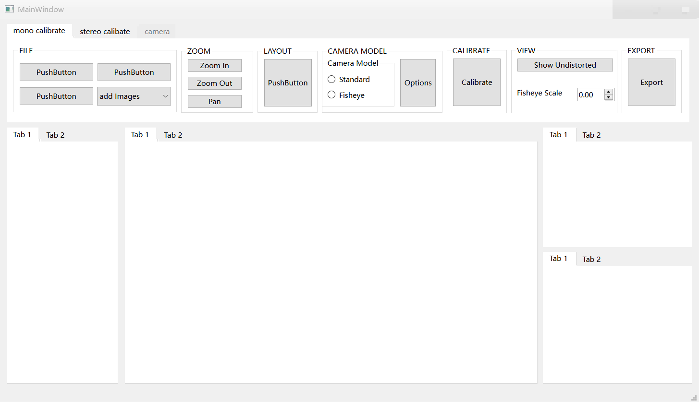
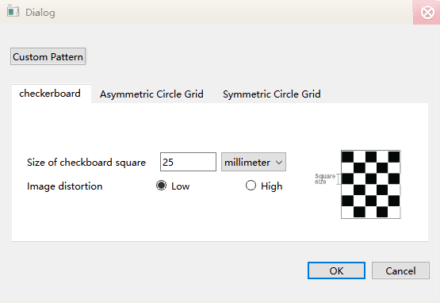
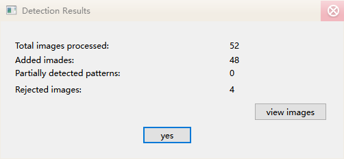

<p align="right">简 | <a href="./src/docs/README-en.md">EN</a></p>


<div align="center">

# 基于Qt+OpenCV的仿照MATLAB的相机标定程序

[](https://www.qt.io/download-open-source)
[](https://github.com/opencv/opencv/tree/4.8.0)

</div>

## 介绍

功能仿照MATLAB的标定程序，输出可直接用opencv读取的标定文件



标定板属性设定





张征友标定板角点检测结果





## 代码结构
```
.
├─3rdpart
│  └─opencv-4.8.0
├─calibrate
│  └─`calibates functions source code`
├─ui
│  └─`ui source code`
│─qrc
│─CMakeLists.txt
│─main.cpp
└─src
   ├─readmeFile
   │  └─`pictures in README`
   └─src
      └─`some picture/gits in project`
```


## ⛓ 施工中...

### TODO 
- [⏱]单目相机标定
    - [✅] 张正友标定板
    - [] asym
    - [] sym
- []双目相机标定
- []鱼眼相机标定
- [⏱]调整标定图像
- [✅]输出单目标定参数
- [⏱]输出读取参数的代码c++\python
- []...


